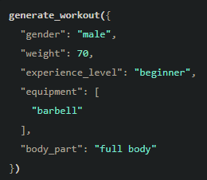
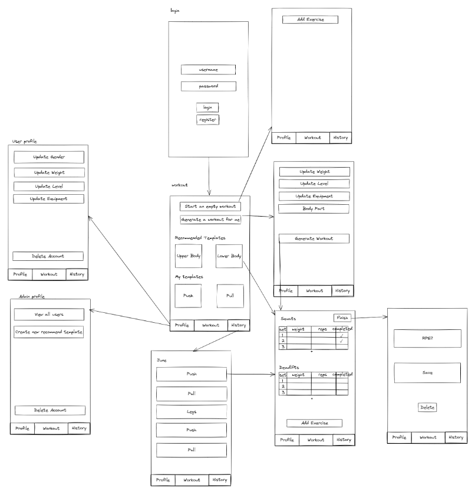
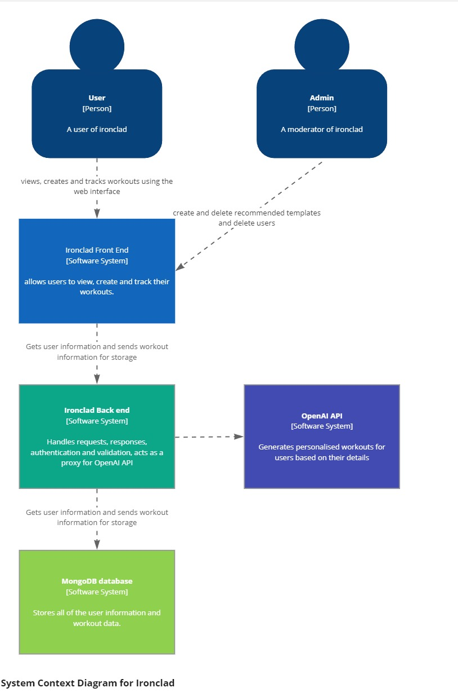

# Ironclad
---------------------

## Description and Context

Ironclad is a  weight training workout tracker that utilises AI to address  key challenges individuals faces when planning their workouts in the gym.  

Ironclad allows users to save workout templates that can generate specific workout sessions. These sessions are made by the user in the app and included detailed information such as exercises, sets, reps as well as the date and the RPE (Rated Perceived Exertion) of each workout.
This helps users to stay organised to ensure their training is effective as possible.  

For users without a workout plan, Ironclad will utilise the OpenAI API to generate workouts customised workouts. This addresses an important challenge for beginners who might not know how to start their fitness journey.

A potential advanced feature of Ironclad is to use OpenAI API to generate a new workout for a user based on previously logged sessions. This will help intermediate and advanced users to avoid stagnation by continually adjusting their routines for progressive overload.

The need for Ironclad arises from several common issues in weight training and fitness planning:

1. **Organisation**: Keeping track of workout details such as exercises, sets, reps and progress over time is important to optimise workouts however can be cumbersome without a proper system.
2. **Lack of Knowledge**: Beginners often do now know how to create effective workout plans which are appropriate for their goals and fitness levels.
3. **Personalization**: Most workout plans do not consider individual differences in fitness levels, available equipment and personal goals, leading to suboptimal training routines and outcomes.
4. **Progressive Overload**: For advanced users, continuously adjusting their workouts to ensure progressive overload can be challenging without a structured approach.

The following code is an example of the code that could be used with OpenAI API to generate workouts. 

```
{
  "name": "generate_workout",
  "description": "Generate a workout for a individual based on experience level, available equipment, and target body part, include exercises, sets, reps and weight in response, respond as a json object",
  "parameters": {
    "type": "object",
    "required": [
      "gender",
      "weight",
      "experience_level",
      "equipment",
      "body_part"
    ],
    "properties": {
      "gender": {
        "enum": [
          "male",
          "female"
        ],
        "type": "string",
        "description": "The gender of the individual"
      },
      "weight": {
        "type": "number",
        "description": "The weight of the individual in kg"
      },
      "body_part": {
        "enum": [
          "full body",
          "upper body",
          "lower body",
          "arms",
          "legs",
          "back",
          "chest",
          "shoulders"
        ],
        "type": "string",
        "description": "The body part to focus on in the workout"
      },
      "equipment": {
        "type": "array",
        "items": {
          "enum": [
            "barbell",
            "dumbbells",
            "bench",
            "squat rack"
          ],
          "type": "string"
        },
        "description": "The equipment available for the workout"
      },
      "experience_level": {
        "enum": [
          "beginner",
          "intermediate",
          "advanced"
        ],
        "type": "string",
        "description": "The experience level of the individual"
      }
    }
  }
}
```



This would return a json object of a workout that would be stored on the database of the server when confirmed by the user so the user can track their workouts.

```json
{
    "workout": {
        "exercises": [
            {
                "name": "Squats",
                "reps": 10,
                "sets": 3,
                "weight": 30
            },
            {
                "name": "Bench Press",
                "reps": 10,
                "sets": 3,
                "weight": 20
            },
            {
                "name": "Barbell Rows",
                "reps": 10,
                "sets": 3,
                "weight": 20
            },
            {
                "name": "Overhead Press",
                "reps": 10,
                "sets": 3,
                "weight": 15
            },
            {
                "name": "Deadlifts",
                "reps": 10,
                "sets": 3,
                "weight": 40
            }
        ]
    }
}
```

## Features
------------------

### MVP

- A user will be able to register and login to access their personalised workout data.
- A user will be able to create and save workout templates
- A user will be able to use a template to track specific workout sessions.
- A user will be able to view their previously completed workouts.
- A user will be able to use AI to generate a workout based on their weight, gender, goals, available equipment and experience level.
- An Admins will be able to create default workout templates
- An Admins will be able to delete users

### Further features

- A user will be able to generate a workout using AI based on their previous workout.
- A user will be able to visualise their progress on exercises through graphs.
- A user will be able to make templates for cardio workouts.
- A user will be able to use AI to generate cardio workouts.

## User Interface
--------------------------
Ironclad will be optimised for small screen devices as it is expected to be used on users phones in the gym. The user interface will be intuitive and user-friendly, with the navbar at the bottom so it is easy to reach with users' thumbs, ensuring ease of use during workout sessions.



## Architecture
--------------------
The user and admins will interact with a React front end web application.
This will communicate with a back end express server which sends data to a mongodb database as well as acting as a proxy for the OpenAI API



## Routing
-------------------
### Users

| Endpoint | Payload | Response | Headers |
| -------- | -------- | -------- | -------- |
| POST /users/register|{email, username, password}|{id,username}||
| POST /users/login|{username,password}|{id,username,role}|jwt|
|GET /users/:id|{id}|{user}|jwt|
|PUT /users/:id|{id, user}|{user}|jwt|
|DELETE /users/:id|{id}||jwt|

### Templates

| Endpoint             | Payload                     | Response           | Headers |
| -------------------- | --------------------------- | ------------------ | ------- |
| POST /templates | {template} |{template}|         |
| PATCH /templates/:id    | {id,template} |{template}|         |
| DELETE /templates/:id    | {id} |{template}|         |
| GET /templates | |[templates]||
| GET /template{id} | |{template}||


### Workout

| Endpoint              | Payload       | Response    | Headers |
| --------------------- | ------------- | ----------- | ------- |
| POST /workouts/:userid       | {userid, workout}    | {workout}  |         |
| PATCH /workouts/:userid/:id  | {userid , id, workout} | {workout}  |         |
| DELETE /workouts/:userid/:id | {userid,id, workout}          | {workout}  |         |
| GET /workouts/:userid        | {userid}               | [workouts] |         |
| GET /workout/id        | {id}               | {workout} |         |

## Technologies
-----------------

- Front-end: HTML, CSS, JavaScript React, Vite, Bootstrap, Axios
- Back-end: JavaScript, NodeJS, Express, Mongoose
- Database: MongoDB
- Authentication: JWT, Bcrypt
- Testing: Vitest, Chai, Mocha
- Version Control: Git

## Deployment
--------------------

The API key for OpenAI API will have to be stored securely in a .env file in the settings on Render for the backend as the repositories will have to be public for deployment.

- Front-end: Render/Netlify
- Back-end: Render
- Database: MongoDB Atlas